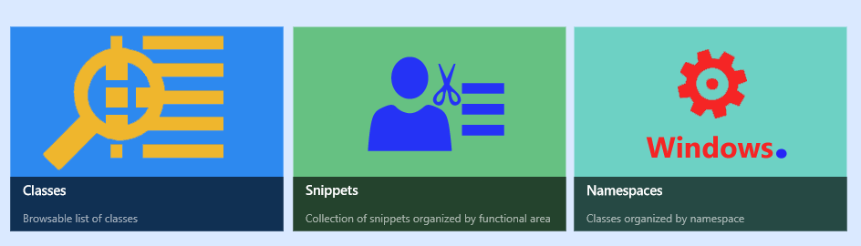
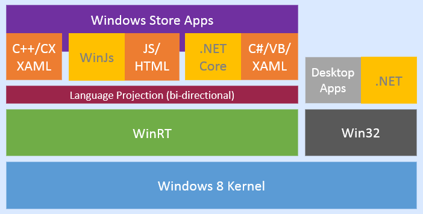
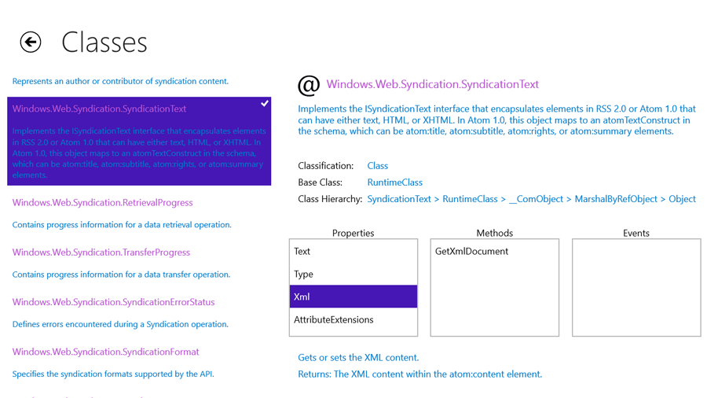
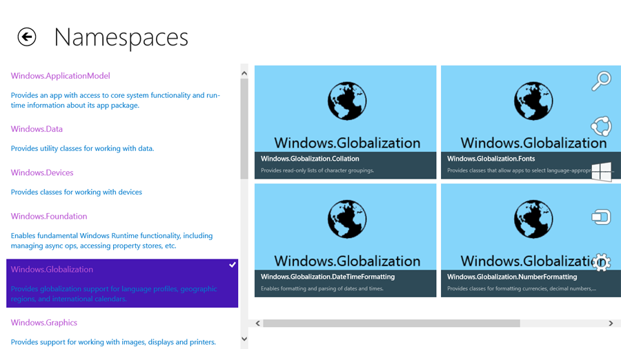
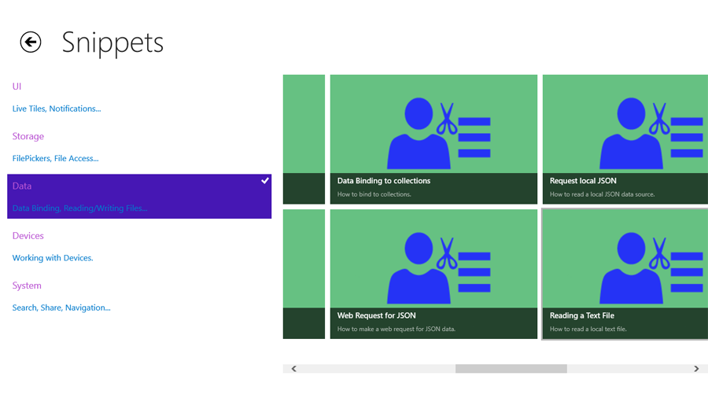
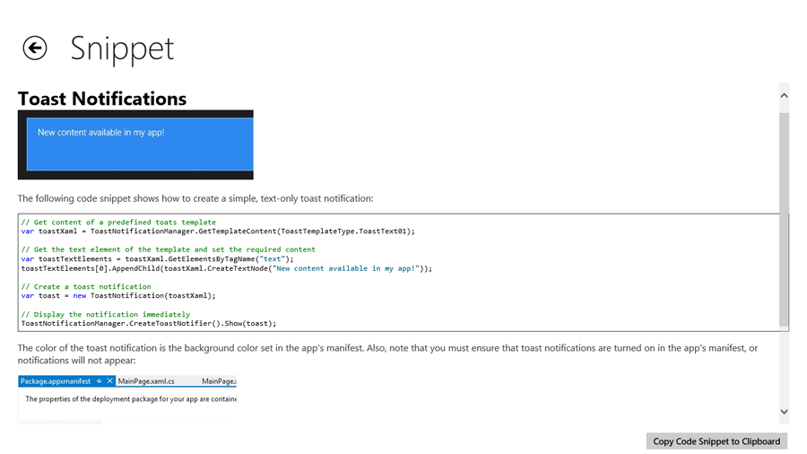

# ClassBrowserPlus

**Archived Visual Studio 2013 project that was previously held in Team Foundation Server.**

Class Browser Plus is a Windows 8 Developer's utility that enables you to view the properties, methods and events (along with help text) for all Windows 8 classes. You can browse all the classes, or view classes grouped by namespace (functional area). The Snippets feature allows you to browse simple, concrete examples of how to use key Windows 8 classes and features. If you like the example code, copy it for your own project with a single click or tap!

## App Features
* View all Windows 8 WinRT classes, along with descriptive text
* View the properties, methods and events in each class, along with help text
* Browse classes categorized by namespace
* View examples of using Windows 8 classes
* Copy code snippets directly for use in your own projects

## What is WinRT?
WinRT (short for Windows Runtime) is the set of APIs used to create Windows Store apps. WinRT APIs are defined in .winmd files that encode metadata using the ECMA 335 format, which is very similar to that of .NET assemblies. WinRT .winmd files do not contain code (this is part of the underlying Windows 8 OS), only metadata.

## Screenshots

